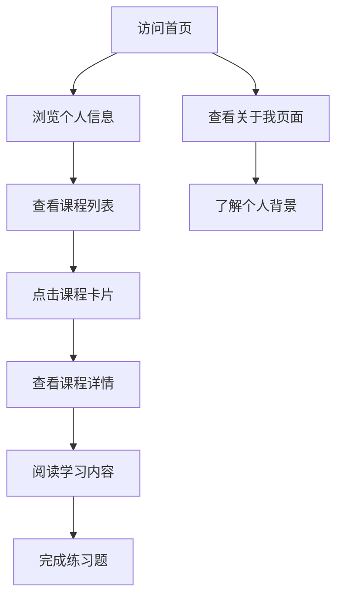

## 1. Product Overview
个人作品集网站，展示广东科学技术职业学院商务数据分析与应用专业学生的技能和课程内容。
- 主要目的是展示学生的专业技能、学习成果和课程内容，帮助潜在雇主或合作伙伴了解学生的能力。
- 目标用户包括招聘单位、同学、老师和行业合作伙伴。

## 2. Core Features

### 2.1 User Roles
| 角色 | 注册方式 | 核心权限 |
|------|---------------------|------------------|
| 访客 | 无需注册 | 浏览网站所有内容，查看课程详情 |
| 管理员 | 本地管理 | 编辑网站内容，更新课程信息 |

### 2.2 Feature Module
1. **首页**：个人信息展示、课程列表、技能概览
2. **课程详情页**：课程大纲、学习内容、练习题
3. **关于我**：个人简介、教育背景、技能展示

### 2.3 Page Details
| 页面名称 | 模块名称 | 功能描述 |
|-----------|-------------|---------------------|
| 首页 | 个人信息区 | 展示姓名、学校、专业信息，包含个人头像和简介 |
| 首页 | 课程卡片区 | 展示所有课程卡片，每个卡片包含课程名称、简介和链接 |
| 首页 | 技能展示区 | 展示核心技能，如前端开发、数据分析等 |
| 课程详情页 | 课程大纲 | 展示课程的学习目标和主要内容 |
| 课程详情页 | 学习内容 | 详细的学习资料，包括代码示例和理论知识 |
| 课程详情页 | 练习题 | 针对课程内容的实践题目和提示 |
| 关于我 | 个人简介 | 详细的个人介绍和职业目标 |
| 关于我 | 教育背景 | 学校、专业、学习经历 |
| 关于我 | 技能展示 | 详细的技能列表和熟练度 |

## 3. Core Process
用户访问网站 → 浏览首页了解基本信息 → 点击课程卡片查看详细内容 → 阅读课程资料和练习题 → 查看关于我页面了解更多个人信息

## 4. User Interface Design
### 4.1 Design Style
- 主色调：蓝色 (#165DFF) 和白色 (#FFFFFF)
- 辅助色：浅灰 (#F5F7FA)、深灰 (#333333)
- 按钮风格：圆角矩形，悬停效果
- 字体：无衬线字体，标题 24px，正文 16px
- 布局风格：卡片式布局，响应式设计
- 图标风格：简约线性图标

### 4.2 Page Design Overview
| 页面名称 | 模块名称 | UI元素 |
|-----------|-------------|-------------|
| 首页 | 个人信息区 | 居中布局，大标题，个人头像圆形显示，背景渐变色 |
| 首页 | 课程卡片区 | 网格布局，每个卡片有不同颜色，悬停时有阴影效果 |
| 首页 | 技能展示区 | 横向排列的技能标签，不同技能有不同颜色 |
| 课程详情页 | 课程大纲 | 列表形式，清晰的层级结构 |
| 课程详情页 | 学习内容 | 代码块有语法高亮，段落间距适中 |
| 课程详情页 | 练习题 | 编号列表，每个题目有提示按钮 |
| 关于我 | 个人简介 | 左对齐文本，适当的行间距 |
| 关于我 | 教育背景 | 时间线形式，清晰展示学习经历 |
| 关于我 | 技能展示 | 进度条形式，直观显示技能熟练度 |

### 4.3 Responsiveness
- 桌面优先设计，支持响应式布局
- 移动端适配：卡片改为单列布局，字体大小调整
- 触摸优化：按钮和链接区域足够大，支持触摸操作

### 4.4 3D Scene Guidance
- 无3D场景需求