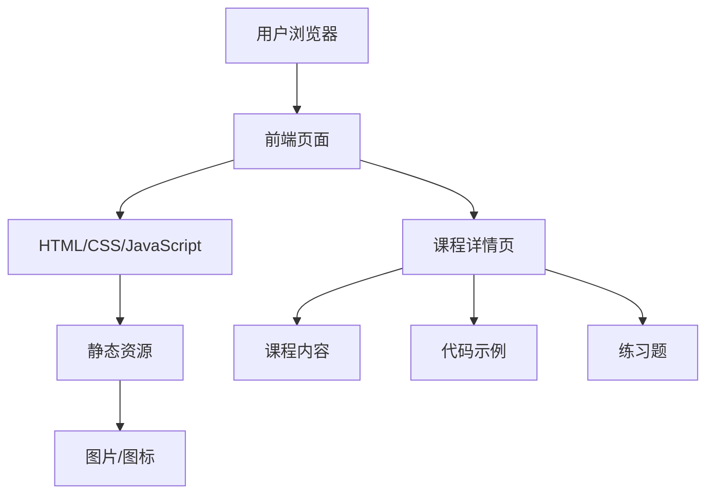

## 1. Architecture Design

## 2. Technology Description
- 前端：HTML5 + CSS3 + JavaScript
- 样式：Tailwind CSS v3
- 图标：SVG图标
- 代码高亮：Prism.js
- 构建工具：无（静态网站）
- 部署：静态网站托管

## 3. Route Definitions
| 路由 | 用途 |
|-------|---------|
| / | 首页，展示个人信息和课程列表 |
| /course-python.html | Python基础课程详情 |
| /course-data-analysis.html | 数据分析技术课程详情 |
| /course-data-collection.html | 数据采集与处理课程详情 |
| /course-supply-chain.html | 供应链数据分析课程详情 |
| /course-database.html | 数据库原理课程详情 |
| /course-html-css.html | HTML & CSS开发课程详情 |
| /course-javascript.html | JavaScript高级编程课程详情 |
| /course-react.html | React框架实战课程详情 |
| /course-vue.html | Vue.js项目开发课程详情 |
| /course-performance.html | 前端性能优化课程详情 |

## 4. API Definitions
- 无后端API需求，网站为纯静态内容

## 5. Server Architecture Diagram
- 无后端服务器需求，网站为纯静态内容

## 6. Data Model
- 无数据库需求，所有内容均为静态HTML文件

### 6.1 Data Model Definition
- 无数据模型需求

### 6.2 Data Definition Language
- 无数据库表结构需求